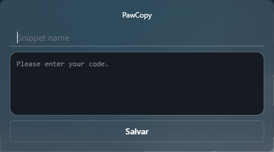
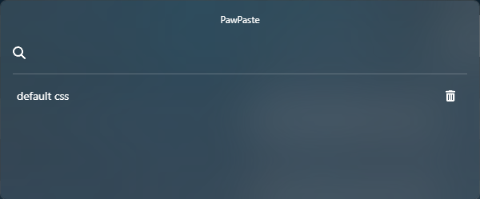

# PawPaste

Um aplicativo criado para oferecer uma maneira rápida e eficiente de salvar e colar trechos de código comuns. Foi desenvolvido usando Tauri para o backend e React, TypeScript e Tailwind para um frontend simples e funcional.

## Funcionamento

### Salvar Snippet
Para salvar um snippet, basta pressionar simultaneamente as teclas ```CTRL + SHIFT + C```. Isso abrirá um prompt onde você poderá fornecer um nome para o snippet e salvá-lo.



### Usar Snippet Salvo
Para utilizar um snippet salvo, basta pressionar simultaneamente as teclas ```CTRL + SHIFT + V```. Isso abrirá um prompt on  de você poderá selecionar o snippet desejado a partir de uma lista. Ao selecioná-lo, ele será automaticamente inserido no programa atualmente aberto.


